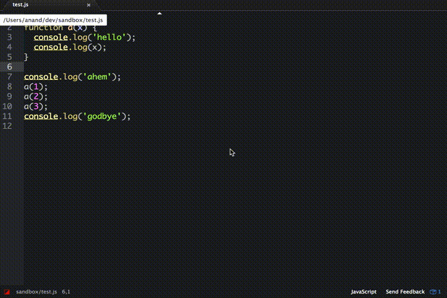

# atom-node-debug package

Debug node code from right within the editor!

We all love (and couldn't live without) the chrome inspector, but sometimes you just don't want
to open up your whole source tree in another browser.

Uses [node-inspector][1] under the hood, via a thin adapter layer provided by [debugger-api][2].

[1]:node-inspector/node-inspector
[2]:anandthakker/debugger-api

# Roadmap

Currently just have step through and breakpoints.  More to come:

- [ ] Open up a new tab when execution leaves current source.
- [ ] TESTS! (Although the underlying API has tests, the ui wiring doesn't.)
- [ ] Breakpoint list
- [ ] Variables
- [ ] Jump up and down the stack
- [ ] Eval
- [ ] Save and continue

And plenty more, I'm sure.

# Contributing

Issues and PR's welcome.

# License

MIT
